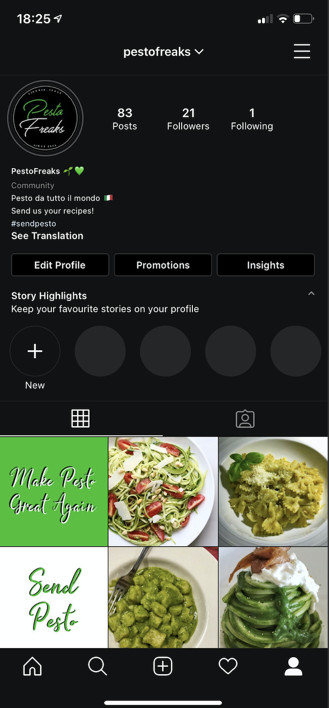

# PestoFreaks Instabot

This is the brain for an instagram bot of a page I created called [Pesto Freaks](https://www.instagram.com/pestofreaks/). The idea is to automate the content creation for Instagram and see the traction it gets in the future.

The app is run through a Cron job in my local server different times a day using the `run_gh.sh` script.

---

### Tools

- Python
- Jupyter Notebooks
- Instabot

---

### Process

The steps it takes are the following:

1. First I use `instagram-scraper` to retrieve 5 images for a variety of tags along with the metadata
2. Download the images from the page Pesto Freaks to compare duplicates
3. Load the image locations in my local server
4. Instagram images have different pixels when reloaded so I do an image similarity between the images I downloaded and the ones in the page to check if there are any duplicates. If an image has above 70% similarity it will get removed
5. Then I check the colors of the images. This is a Pesto page so I want them to be very green.
   - Get the colors of all the pixels
   - Cluster them using Scipy
   - Find the top 50 clusters
   - Group the cluster to see the most frequent ones
   - Approximate the Hex colors to CSS colors and filter for a list of greens that I selected
6. Then I use the metadata of the image to find who the orignial poster is and create a list of image location and original poster username
7. Upload the images with a random caption from a library of captions I came up with making sure to call the original poster out
8. Finally I upload a random quote from a library of corny jokes I came up with.

---

### Screenshot

Here's an image of the page. All posts are posted automatically.

